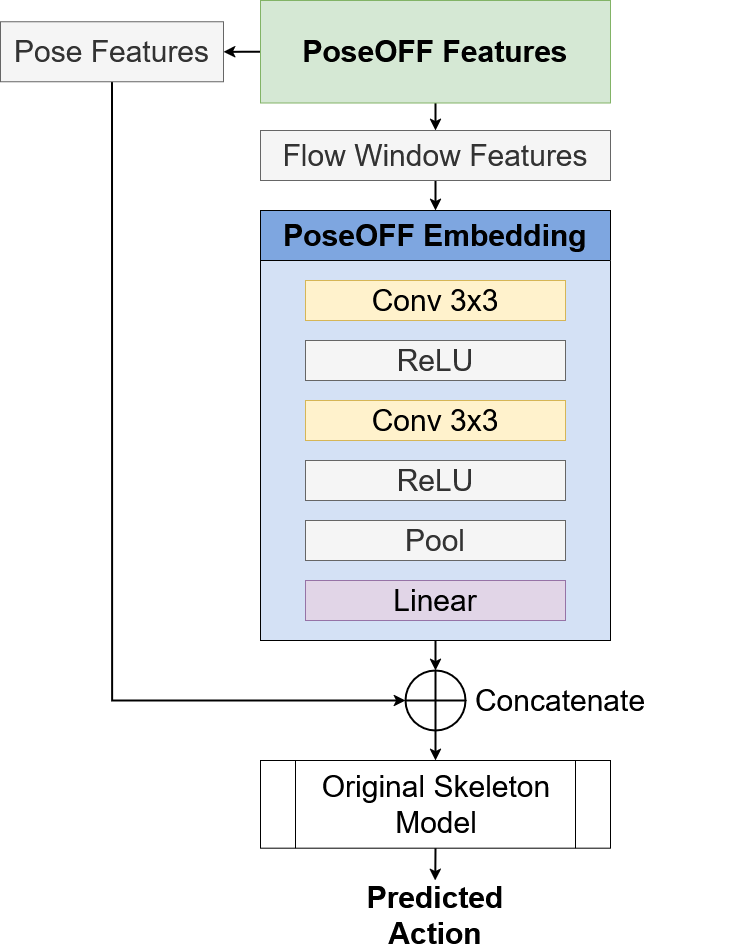

# PoseOFF
PoseOFF is an acronym - Pose-guided Optical Flow Features. With a simple modification to existing skeleton-based action recognition neural networks, PoseOFF provides enhanced action recognition and action anticipation performance - even to networks designed for offline action recognition! See the figures below, or request access to the PoseOFF paper [in-prep] by contacting the manager of this repository.

This repo provides the code to:
- Extract the PoseOFF data from three different datasets ([NTU RGB+D, NTU RGB+D 120](https://rose1.ntu.edu.sg/dataset/actionRecognition/) and [UCF101](https://www.crcv.ucf.edu/research/data-sets/ucf101/)).
- Train and test three different skeleton-based action recognition models using skeleton-only data and PoseOFF data.
- Visualise the PoseOFF data, and training results for each of the models.

The models used in this repo can be found using the following links:

| Model     | Paper                            | GitHub                                  |
|:----------|:---------------------------------|:----------------------------------------|
| InfoGCN++ | https://arxiv.org/abs/2310.10547 | https://github.com/stnoah1/infogcn2     |
| MS-G3D    | https://arxiv.org/abs/2003.14111 | https://github.com/kenziyuliu/ms-g3d    |
| ST-GCN++  | https://arxiv.org/pdf/2205.09443 | https://github.com/kennymckormick/pyskl |

**COMING SOON**
Model Zoo - weights for each of the above model backbones trained on the datasets listed above.

**Before you begin**, if you plan to retrain models using the datasets mentioned above, you should get in touch with the team that maintains the NTU RGB+D/120 datasets to apply for access to the datasets. This can be done by following [this link](https://rose1.ntu.edu.sg/dataset/actionRecognition/), scrolling all the way to the bottom of the page and creating an account in order to apply for access to the data. You will only need the skeleton and RGB data - but be warned, they are very large! If you have access to space on a supercomputer, clone this repo there and put there!

# How Does PoseOFF Work?
## The extraction pipeline
The PoseOFF extraction pipeline involves strategically sampling windows of optical flow surrounding human pose keypoints in image space. The figure below provides a high-level overview of how the extraction pipeline functions.


## Feature embedding
The embedding layer of skeleton-based action recognition neural networks is replaced with a CNN that learns optical flow features extraction from the pipeline, and embeds them into the network. This early fusion approach does not change the backbone of the action recognition models, but boosts performance on tasks of action recognition and action anticipation. Below is the network design for the feature embedding layer added to the skeleton action recognition models.



## NTU RGB+D / NTU RGB+D120 extraction
For each dataset, the following files will need to be run in this order:
| File | Time | Memory | CUDA |
| --- | --- | --- | --- |
| `get_raw_skes_data.py` | 1.5 hours | 10g? | ❌ |
| `get_raw_denoised_data.py` | 20 minutes | 6g | ❌ |
| `get_poseoff_samples.py` (batches of 2000) | ~8.5 hours | 25g | ✔ |
| the code block below (to combine each extraction) | 10 minutes | 75g | ❌ |
| `seq_transformation.py` | 2 hours | 450g? | ❌ |

Edit the file `data_gen/NTU/ntu_gendata.sh` and comment out each section as you go.
**NOTE:**: some work may need to be done to ensure that you're using the correct form of optical flow extraction.
Refer to the table above for resources needed for these extractions.

<u>get_raw_skes_data.py</u>
- Extracts raw skeleton data, saving the skeleton data, frame counts, and frame drops to individual pickle files.
<u>get_raw_denoised_data.py</u>
- Cleans up the data, denoising for length, missing frames, spread, motion, etc. 
<u>get_poseoff_samples.py</u>
- Processes in batches of 2000 by default, gets *flow* data surrounding each keypoint, saving temporary files for each batch as pickle files which are concatenated with `concat_flow`.
<u>seq_transformation.py</u>
- Aligns the sequences, this runs twice, first to split the dataset into `x_train`, `y_train`, `x_test`, and `y_test` splits for each evaluation (e.g. `CV` and `CS` for ntu), saving the full dataset as a `.npz` file (the pose and PoseOFF datasets are saved separately), then runs again using the `data_gen.utils.postprocess.create_aligned_dataset()` which aligns *just* the skeletons, then appends the flow data to this. Each split (e.g. `x_test`) is of shape `(N, T, (M V C))`, whic corresponds to (number of samples in split, frames (300), (bodies, vertices, channels)).

```python
dataset = 'ntu120'
data_path = f'./data/{dataset}/flow_data'
files = os.listdir(data_path)
files.sort()

flow_data = []

# Iterate over the files
for file in files:
    print(f'Appending {file}')
    with open(osp.join(in_path,file), 'rb') as fr:  # load raw skeletons data
        data = pickle.load(fr)
    
    for sample in data:
        flow_data.append(sample)
    print(f'Flow data samples: {len(flow_data)}')


with open(osp.join(data_path, 'flow_data.pkl'), 'wb') as f:
    pickle.dump(flow_data, f, pickle.HIGHEST_PROTOCOL)
```

<!-- TODO: Create the extraction pipeline for the NW-UCLA dataset -->
<!-- ## NW-UCLA extract -->
<!-- - Download the data (put it in any folder you like...) -->
<!-- - The val_labels.pkl are already in the `./data/nucla/statistics/` folder -->

# UCF-101 Data Generation
First, prepare for optical flow and pose extraction:
- Download the data [link](https://www.crcv.ucf.edu/data/UCF101.php)
  - You must download the *UCF101 data set* itself AND the *Train/Test Splits for Action Recognition* (text files)
  - **NOTE:** The extraction pipeline assumes that the dataset and train/test split .txt files are within the same directory initially as follows:
    ```
    ../Datasets/UCF-101
    |-- ApplyEyeMakeup
    |   |-- v_ApplyEyeMakeup_g01_c01.avi
    |   |-- ...
    |   \-- v_ApplyEyeMakeup_g25_c07.avi
    |-- ...
    |-- testlist01.txt
    |-- ...
    \-- trainlist03.txt
    ```
- In the config files `./data/config/ucf101/*.yaml` update the following properties:
  - extractor: data_paths: rgb_path: 
    - Default is `../Datasets/UCF-101/`

Run the bash script to generate annotations and extract the optical flow, pose and then PoseOFF for the ucf101 dataset.

``` bash
bash ./data_gen/ucf101/ucf101_extract.sh
```


Uncomment the appropriate line in [the extraction file](data_gen/UCF-101_extract.sh). Optical flow and pose extraction must precede PoseOFF extraction.

From the root directory, sbatch the extraction file.
```
bash data_gen/ucf101/UCF-101_extract.sh
```

Depending on whether you're extracting optical flow or poses, this may take a few hours. 

TODO: Make sure this section makes sense. Is there a better way to go about doing it?
NOTE: You must add this folder to your PYTHONPATH
```
export PYTHONPATH="${PYTHONPATH}:/path/to/this/folder/MS-G3D"
```

## Graphing data extraction
- Find a good video sample using `data/visualisations/data_vis.py`
    - In "__main__" section, provide a `video_name` and if it's not suitable, possible video names will be provided

- Extract the optical flow using:
    ```bash
    srun --time=0:05:00 --gres=gpu:1 --mem-per-cpu=16G python data/visualisations/get_flow_samples.py --dataset ntu --sample_name [SAMPLE_NAME]
    ```
    - This creates a `.npz` file with keys `["pose", "rgb", "flow"]` and saves it as:
        - `data/visualisations/RAW/[SAMPLE_NAME].npz`

- 
